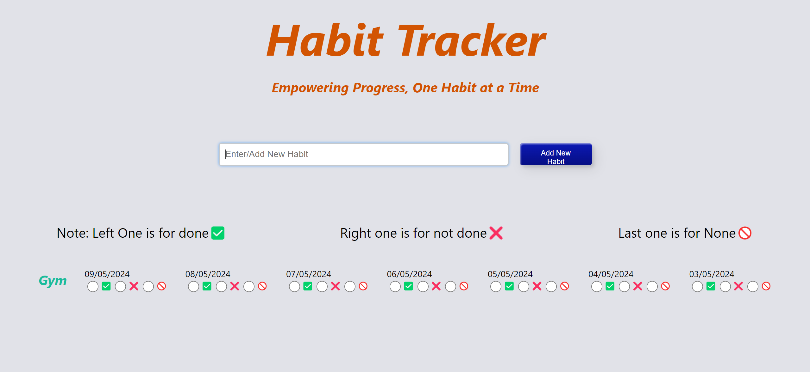

# Habit Tracker - 🏋️‍♂️📒💃
## ⭐ Introduction 

This is Habit tacker web app which is build using ReactJS and redux🚀

## Screenshots
Home Page

Tracker Page

## Features

- Introduction to the Habit Tracker Web App:
This app uses power of react library to display the record of user tracking his habits. 
The info uses redux to store information and rerender the info at the UI for today and of 6 previous days.

## 🔨 Tools Used

